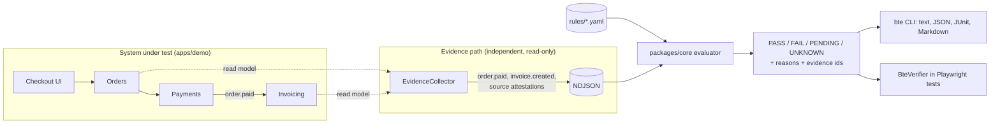

# Architecture

BTE answers one question from evidence: **did the business outcome actually happen, exactly as
the invariant demands?** It does so with four honest verdicts and a core that nothing else can
contaminate.

## Components

| Component             | Responsibility                                                               | Depends on                                |
| --------------------- | ---------------------------------------------------------------------------- | ----------------------------------------- |
| `packages/core`       | Contracts (Zod), `EvidenceSet` dedup, deterministic evaluator, `Clock`       | `zod` only; no Node APIs (lint-enforced)  |
| `packages/rules`      | Load and validate YAML rules, JSON Schema export                             | core, `yaml`                              |
| `packages/evidence`   | NDJSON read/write, in-memory append-only store                               | core                                      |
| `apps/cli`            | `bte evaluate / validate / schema`; text, JSON, JUnit, Markdown; exit codes  | core, rules, evidence, `commander`        |
| `apps/demo`           | Fastify shop with seeded invoicing faults and a read-only evidence collector | core (contracts), evidence, `fastify`     |
| `packages/playwright` | `BteVerifier`: evaluate rules from fetched evidence inside Playwright tests  | core, evidence, rules, `@playwright/test` |
| `tests/e2e`           | Playwright suite: per-worker demo server, page objects, `DemoApi`, specs     | demo, playwright, rules                   |

The dependency direction is enforced by `no-restricted-imports` overrides in `eslint.config.js`:
core imports nothing from the workspace or the platform; rules and evidence import core only; the
Playwright package never imports the demo; the demo never imports the CLI, rules or the Playwright
package; demo domain modules never import evidence code.

## Data flow for one verdict

1. A rule names a trigger type (`order.paid`), a correlation key (`orderId`), and expectations
   (`invoice.created` from source `invoicing`, exactly one, within 120s, amount/currency equal).
2. Evidence records arrive in any order, possibly more than once. `EvidenceSet.from()` collapses
   redeliveries by `eventId`, keeps the latest `source` attestation per source, and sorts.
3. For each trigger event, the evaluator computes the window from `occurredAt`, selects matching
   observations by source and correlation value, places them (early / in-window / late), checks
   assertions and cardinality, and consults the source attestation (`available`, `authoritative`,
   `completeThrough`).
4. The verdict carries ordered reasons, each with a stable code and the evidence ids it rests on.
   The full decision procedure is ADR 0002.

## Time

Two clocks exist. Business time (`occurredAt`) places observations in windows. Collection time
(`collectedAt`) only orders redeliveries. Evaluation time (`now`) comes from an injected `Clock`:
`FixedClock` in the CLI (`--now`), `ManualClock` in tests and demo scenarios, `SystemClock` only at
process edges. Same rules + same evidence + same `now` = byte-identical output.

## Extension points

- **Evidence adapters**: anything that can produce `EvidenceRecord`s (log scrapers, DB pollers,
  queue taps) plugs into the same evaluator. The demo's `EvidenceCollector` is the reference.
- **Storage**: NDJSON today; a PostgreSQL store implements the same two record kinds (ADR 0003).
- **Assertions**: `packages/core/src/evaluate/assertions.ts`; new operators extend the Zod enum
  and the switch, and must stay total (no silent `undefined`).
- **Reporters**: `apps/cli/src/report.ts` renders from `EvaluationReport`; add a renderer, not a
  new data path.

## Non-goals (for now)

LLM-generated rules, cross-rule dependencies, aggregate assertions across observations, and
multi-process demo persistence. See ROADMAP.md.
